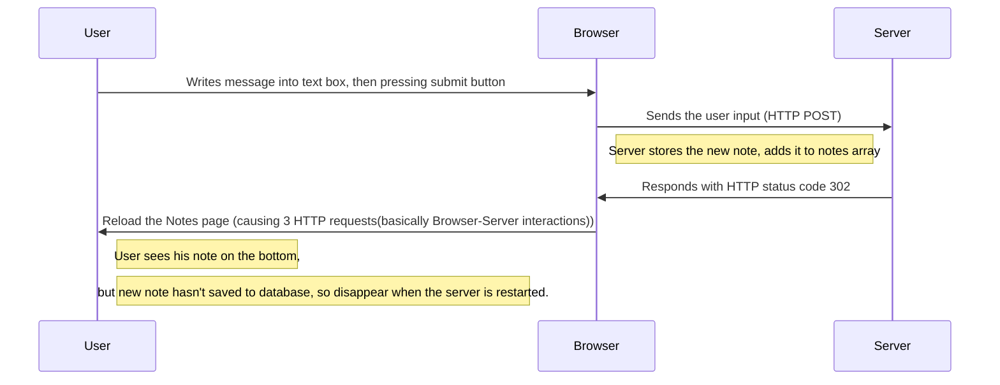

```mermaid
sequenceDiagram
    participant User
    participant Browser
    participant Server
    
    User->>Browser: Writes message into text box, then pressing submit button
    Browser->>Server: Sends the user input (HTTP POST)
    Note right of Browser: Server stores the new note, adds it to notes array
    Server->>Browser: Responds with HTTP status code 302
    Browser->>User: Reload the Notes page (causing 3 HTTP requests(basically Browser-Server interactions))
    Note right of User: User sees his note on the bottom, 
    Note right of User: but new note hasn't saved to database, so disappear when the server is restarted.
```
