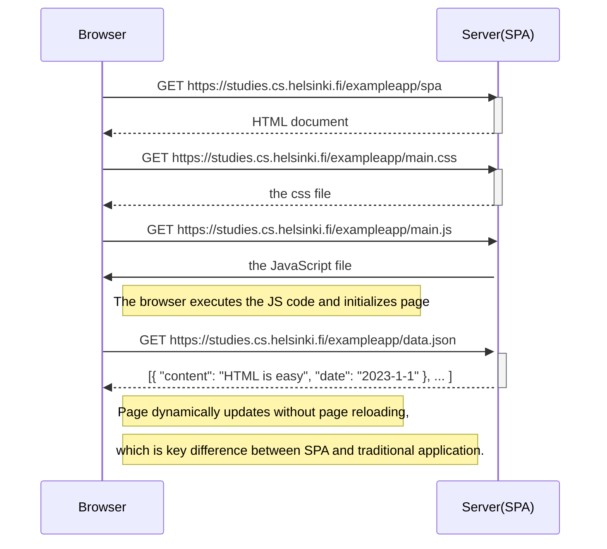

```mermaid
sequenceDiagram
    participant Browser
    participant Server(SPA)

    Browser->>Server(SPA): GET https://studies.cs.helsinki.fi/exampleapp/spa
    activate Server(SPA)
    Server(SPA)-->>Browser: HTML document
    deactivate Server(SPA)
    
    Browser->>Server(SPA): GET https://studies.cs.helsinki.fi/exampleapp/main.css
    activate Server(SPA)
    Server(SPA)-->>Browser: the css file
    deactivate Server(SPA)

    Browser->>Server(SPA): GET https://studies.cs.helsinki.fi/exampleapp/main.js
    activate Server(SPA)
    Server(SPA)->>Browser: the JavaScript file

    Note right of Browser: The browser executes the JS code and initializes page

    Browser->>Server(SPA): GET https://studies.cs.helsinki.fi/exampleapp/data.json
    activate Server(SPA)
    Server(SPA)-->>Browser: [{ "content": "HTML is easy", "date": "2023-1-1" }, ... ]
    deactivate Server(SPA)

    Note right of Browser: Page dynamically updates without page reloading,
    Note right of Browser: which is key difference between SPA and traditional application.
```
