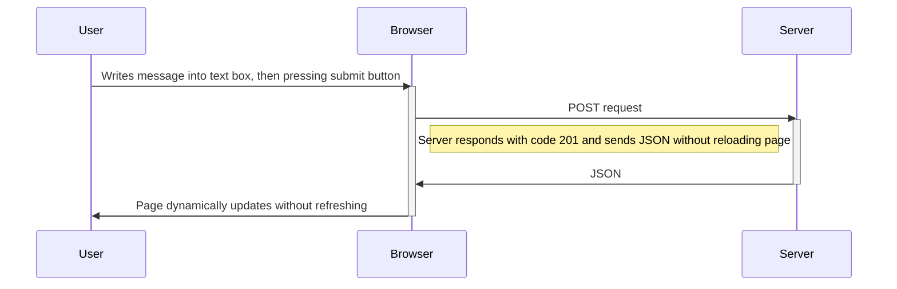

```mermaid
sequenceDiagram
    participant User
    participant Browser
    participant Server

    User->>Browser: Writes message into text box, then pressing submit button
    activate Browser
    Browser->>Server: POST request
    activate Server
    Note right of Browser: Server responds with code 201 and sends JSON without reloading page
    Server->>Browser: JSON
    deactivate Server
    Browser->>User: Page dynamically updates without refreshing
    deactivate Browser
```
